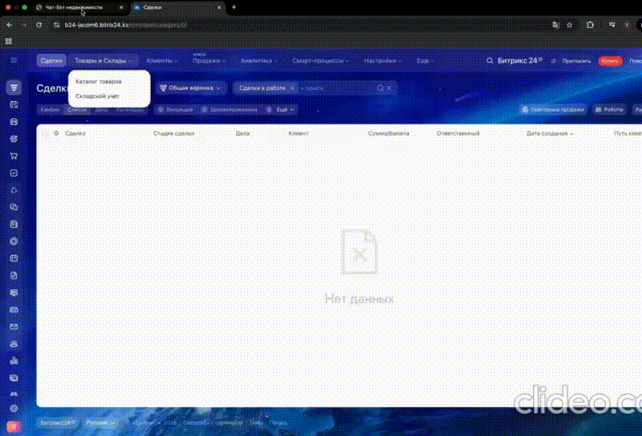
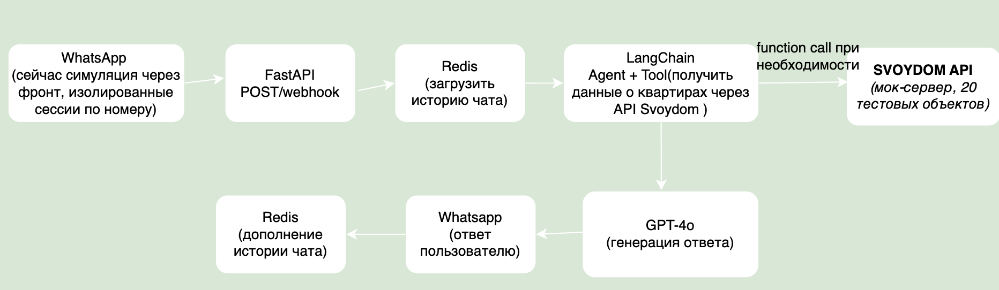
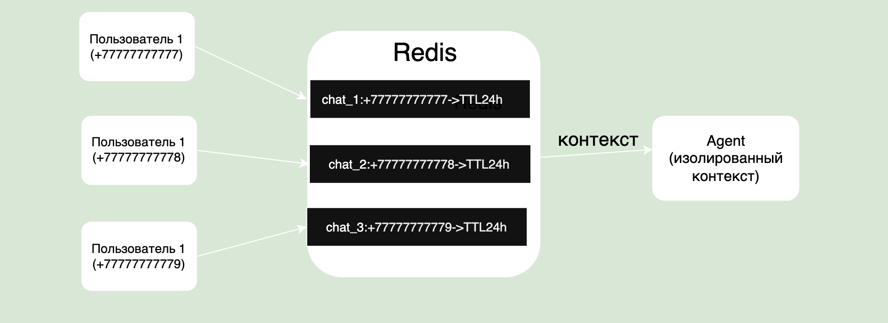
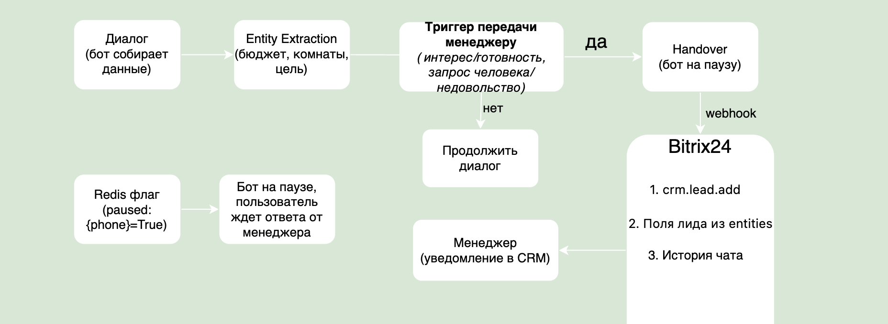

# SVOYDOM Chatbot

## Демо


---

## Как запустить

1. Заполни `.env` в корне проекта:
   - `OPENAI_API_KEY`
   - `REDIS_URL`
   - `BITRIX_WEBHOOK_URL`

2. Запусти:
```bash
docker compose up --build
```

3. Открой в браузере: `http://localhost:3000`

---

## О проекте

AI-чатбот для первичной коммуникации с клиентами с интеграцией в Bitrix24.  
Реализован как MVP с симуляцией WhatsApp через веб-интерфейс.

**Стек:** Python, FastAPI, LangChain, GPT-4o, Redis, Bitrix24 REST API, Docker

---

## Детали реализации

**Фронтенд (симуляция WhatsApp)**  
Так как подключение реального WhatsApp Business API требует верифицированного бизнес-аккаунта, реализован веб-чат. В интерфейсе можно создать несколько чатов с разными номерами телефона — каждый имеет полностью изолированный контекст, что позволяет проверить многопользовательский режим.

**SVOYDOM API**  
Реальный API закрытый поэтому в `backend/tools/svoydom.py` реализована функция для получения 20 захардкоженных тестовых объектов недвижимости.

**Function Calling**  
Используется LangChain Agent с инструментом `search_apartments`. Агент самостоятельно решает когда вызывать функцию — когда пользователь запрашивает квартиры по параметрам (цена, район, количество комнат, ЖК) или когда сформировалась достаточная картина о предпочтениях клиента.

**Entity Extraction**  
После каждого сообщения LLM параллельно извлекает параметры клиента (имя, телефон, бюджет, количество комнат, цель покупки, район) и накапливает их в Redis. Данные не перезаписываются — только дополняются новой информацией.

**Handover Logic**  
LLM классифицирует намерение клиента после каждого сообщения. Передача менеджеру происходит в двух случаях:
- Клиент готов к покупке — заинтересовался конкретным вариантом, просит встречу или звонок
- Клиент просит живого человека или выражает недовольство ботом

При срабатывании триггера:
1. В Bitrix24 через REST API создаётся лид с извлечёнными параметрами и полной историей диалога в поле COMMENTS
2. Ответственный менеджер получает уведомление в CRM
3. В Redis записывается флаг `paused:{phone}` — бот перестаёт отвечать, менеджер ведёт клиента сам

**Устойчивость к prompt injection**  
Системный промпт содержит явные ограничения на выход из роли. Дополнительно перед каждым сообщением запускается LLM-классификатор который определяет попытку взлома и возвращает клиента к теме недвижимости.

---

## Архитектура

### 1. Жизненный цикл сообщения



### 2. Memory Management

Каждый пользователь идентифицируется по номеру телефона — в Redis создаётся отдельный ключ с историей сообщений и извлечёнными параметрами (бюджет, комнаты, цель). Все диалоги изолированы друг от друга.

### 3. Интеграция с Bitrix24

На протяжении диалога каждое сообщение параллельно анализируется LLM — извлекаются параметры клиента (бюджет, комнаты, цель, имя, телефон) и проверяется намерение на handover. Если LLM определяет что клиент готов к покупке, недоволен или просит живого человека — активируется Handover Logic. В этот момент в Bitrix24 создаётся лид с собранными параметрами и полной историей диалога в поле COMMENTS, менеджер получает уведомление в CRM, а в Redis записывается флаг paused — бот перестаёт отвечать пока менеджер ведёт клиента сам.

---

## Backend API

| Метод | Endpoint | Описание |
|-------|----------|----------|
| POST | `/chats` | Создать новый чат |
| GET | `/chats/{phone}` | Получить историю диалога |
| POST | `/chats/{phone}/messages` | Отправить сообщение |